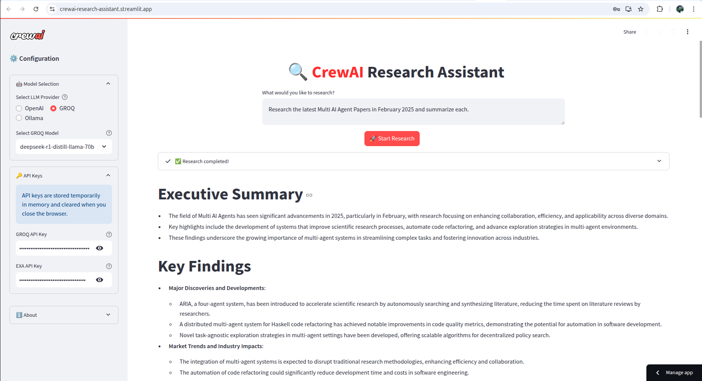

# 🔍 CrewAI Research Assistant  

An advanced research assistant powered by CrewAI, Exa, and Streamlit, designed to explore any topic using AI agents.  

.svg)  


**Open it Here!**


  

## 🌟 Highlights  
- 🤖 Support for multiple LLMs  
- 🔍 Enhanced response generation powered by Exa  
- 📊 Live tracking of research progress  
- 📝 Organized report generation  
- 🎯 Targeted topic exploration  
- 🔒 Secure API key handling  
- 📱 Sleek, user-friendly interface  

## 📚 Code Structure  
- **Main App (`streamlit_app.py`)**  
  - Manages Streamlit UI configuration  
  - Coordinates research workflows  
  - Displays final outcomes  

- **Research Module (`researcher.py`)**  
  - Sets up LLM providers (OpenAI, GROQ, Ollama)  
  - Initializes research agents with tools  
  - Structures research tasks  
  - Oversees execution flow  

- **Sidebar Module (`sidebar.py`)**  
  - Handles model selection UI  
  - Manages credential inputs  
  - Connects to local Ollama  
  - Offers customization settings  

- **Output Manager (`output_handler.py`)**  
  - Formats and displays intermediate outputs  
  - Updates UI in real-time  

## 🛠️ Directory Layout  
```
crewai-research-assistant/
├── app.py # Primary Streamlit app entry file  
├── requirements.txt # Dependency list  
└── source/  
├── components/  
│ ├── researcher.py # Core research logic  
│ │ # - LLM setup  
│ │ # - Task design  
│ │ # - Exa integration  
│ └── sidebar.py # Configuration panel  
│ # - Model switching  
│ # - API key handling  
│ # - Local Ollama setup  
└── utils/  
└── output_handler.py # Output processing  
   # - Live data capture  
   # - Formatting utilities  
```  

## 📋 Prerequisites  
- Python ≥3.10 and <3.13  
- OpenAI/GROQ API keys  
- Exa API key  
- Streamlit installation  

## 🚀 Quick Start  
1. Clone repo:  
```bash  
git clone https://github.com/billy-enrizky/crewai-research-assistant/
cd crewai-research-assistant 
```  

2. Set up virtual environment:  
```bash  
python -m venv .venv  
source .venv/bin/activate  # Windows: `.venv\Scripts\activate`  
```  

3. Install packages:  
```bash  
pip install -r requirements.txt  
```  

4. Launch app:  
```bash  
streamlit run streamlit_app.py  
```  

## 🔑 API Configuration  
Required credentials:  
1. **OpenAI** or **GROQ Key**  
   - OpenAI: [Get key](https://platform.openai.com/)  
   - GROQ: [Get key](https://console.groq.com/)  

2. **Exa Key**  
   - [Obtain here](https://exa.ai)  

Input these keys in the application's sidebar when requested.  

## 🎯 How to Use  
1. Launch the app in your browser  
2. Choose LLM provider (OpenAI/GROQ)  
3. Input API keys via sidebar  
4. Enter research question  
5. Click "Start Research"  
6. Monitor live progress and results  

## 💡 Feature Breakdown  
### Research Agent  
(`src/components/researcher.py`) utilizes CrewAI to:  
- Perform in-depth topic investigations  
- Synthesize and condense information  
- Deliver structured reports  

### Live Tracking  
(`src/utils/output_handler.py`) offers:  
- Instant progress visualization  
- Well-formatted outputs  
- Step-by-step monitoring  

### Interface  
Modern UI includes:  
- Intuitive configuration panel  
- Clear progress displays  
- Professional result formatting  

## 🤝 Contributions  
We welcome contributions! Feel free to submit PRs.  

## 📄 Licensing  
MIT Licensed - See LICENSE file.  

## 🙏 Credits  
- [CrewAI](https://crewai.com) for agent framework  
- [Exa](https://exa.ai) for search technology  
- [Streamlit](https://streamlit.io) for UI  

---  
Built with ❤️ using CrewAI, Exa, and Streamlit
